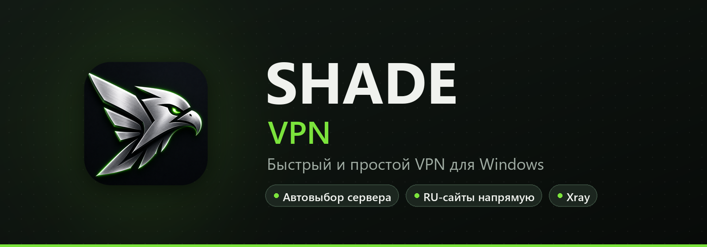

  

  

  
  
  

  Подключение в один клик, автовыбор самого быстрого сервера 
  и российские сайты напрямую - без лишних настроек.

---

## ✨ Возможности

<table>
  <tr><td>⚡&nbsp;<b>Один клик</b></td><td>Нажал «Подключить» - и всё работает. Может сам запускаться и подключаться вместе с Windows</td></tr>
  <tr><td>🌍&nbsp;<b>Автовыбор сервера</b></td><td>Приложение само держит самый быстрый сервер и переключается, если он просел</td></tr>
  <tr><td>🏠&nbsp;<b>RU-сайты напрямую</b></td><td>Банки, Госуслуги, маркетплейсы и ВК открываются без VPN. Можно добавить свои сайты и программы</td></tr>
  <tr><td>🔄&nbsp;<b>Без обрывов</b></td><td>После сна ноутбука или смены Wi-Fi VPN переподключается сам</td></tr>
  <tr><td>🛡&nbsp;<b>Современные протоколы</b></td><td>Ядро Xray: VLESS, Reality, xhttp</td></tr>
  <tr><td>🔒&nbsp;<b>DNS на выбор</b></td><td>Из подписки, Cloudflare, Google, Яндекс или свой</td></tr>
  <tr><td>📥&nbsp;<b>Обновляется сам</b></td><td>Новая версия приходит прямо в приложение</td></tr>
</table>

## 📥 Установка

1. **Скачай** установщик по кнопке выше (около 17 МБ).
2. **Запусти** `ShadeVPN-Setup.exe`. Если появится синее окно «Windows защитил ваш компьютер» - нажми **«Подробнее» → «Выполнить в любом случае»**.
3. **Открой** Shade VPN, вставь ссылку-подписку из бота и нажми **«Подключить»**.

## ❓ Частые вопросы

<b>Почему Windows предупреждает об установщике?</b>

 
Так Windows встречает любую программу без платного сертификата разработчика. Установщик собирается из исходников и выкладывается только здесь. Нажми «Подробнее» → «Выполнить в любом случае».

<b>Зачем приложению права администратора?</b>

 
Чтобы создать сетевой адаптер туннеля и направить через него трафик. Без этого VPN на Windows работать не может.

<b>Как обновиться?</b>

 
Ничего делать не нужно: приложение само проверяет обновления и предложит установить новую версию. Можно и вручную - скачать установщик и поставить поверх, настройки сохранятся.

<b>Какой-то российский сайт не открывается с VPN</b>

 
Включи в настройках «RU-сервисы напрямую». Если нужного сайта нет в списке - добавь его сам во вкладке «Сайты», а программу - во вкладке «Приложения».

<b>Есть версия для телефона?</b>

 
Версия для Android скоро появится в Google Play. Следи за новостями в канале.

## 💻 Требования

- Windows 10 или 11, 64-бит
- около 100 МБ свободного места

## 💬 Поддержка

Вопросы и новости - в Telegram: **[@shade_vpn](https://t.me/shade_vpn)**

---

© 2026 Shade VPN · <a href="https://github.com/MAGAMxx/shade-vpn-releases/releases">все версии</a>

